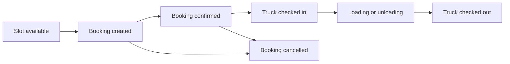
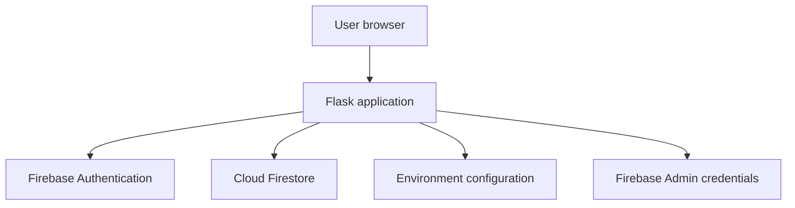

# Terminal Slot Booking System

A proof-of-concept web application for coordinating truck arrivals at terminal loading and unloading bays.

## Overview

Terminal congestion often occurs when multiple trucks arrive without coordinated appointment times. Unplanned arrivals can create long queues, block internal traffic, reduce bay utilization, and increase turnaround time for both transporters and terminal teams.

This project demonstrates a lightweight digital slot-booking workflow that allows truck movements to be planned around controlled loading and unloading windows. Users can view available slots, create bookings, manage booking progress, and record truck attendance from arrival through departure.

The application is a functional proof of concept. It is intended to validate the operating model, core workflow, and user experience before any decision is made to develop a production-grade solution.

## Business Problem

Without a structured appointment process, terminal teams have limited visibility of:

- how many trucks are expected
- when each truck is expected to arrive
- which loading or unloading activity each truck is performing
- whether the terminal has enough capacity for the expected demand
- which trucks are waiting, being served, or have completed their visit

This lack of coordination may result in:

- long truck waiting times
- queues outside or within the terminal
- bottlenecks during peak periods
- uneven use of loading and unloading bays
- disruption to terminal operations
- limited data for operational planning and performance analysis

## Proposed Solution

The Terminal Slot Booking System introduces a controlled appointment process:

1. An authorized user signs in.
2. The user reviews available booking windows.
3. A suitable slot is reserved for a truck movement.
4. Terminal users monitor upcoming and active bookings.
5. The truck is checked in when it arrives.
6. The booking is updated as the terminal activity progresses.
7. The truck is checked out when the visit is complete.

This workflow provides earlier visibility of expected arrivals and creates a basic operational record of each terminal visit.

## POC Objectives

The proof of concept is designed to test whether a slot-booking process can:

- spread truck arrivals more evenly across operating hours
- reduce uncontrolled queue buildup
- give terminal teams advance visibility of scheduled movements
- improve coordination between transporters and terminal personnel
- provide a simple record of bookings, arrivals, and departures
- support future reporting on waiting time and turnaround performance
- validate user acceptance before investing in a larger implementation

## Intended Users

The application supports role-based access. The exact role names and permissions should follow the configuration in the current implementation, but the operating model may include:

| User type | Typical responsibility |
| --- | --- |
| Transporter or booking user | View availability, reserve slots, and review submitted bookings |
| Terminal operations user | Review the daily schedule and update operational booking status |
| Gate or attendance user | Record truck check-in and check-out activity |
| Administrator | Manage access, oversee bookings, and maintain relevant configuration |

Role separation helps ensure that users only see or perform actions relevant to their responsibilities.

## Core Features

- Truck slot booking workflow
- Visibility of available booking windows
- Role-based authentication and access
- Booking status management
- Truck check-in and check-out tracking
- Basic dashboards for different user roles
- Firebase-backed persistence for rapid prototyping
- Lightweight Flask application structure

## Conceptual Booking Lifecycle

The booking lifecycle represents a truck's progress through the terminal. The precise status names may differ in the implementation.



This lifecycle can later be expanded to support approval, rescheduling, no-show handling, rejection, late arrival, and exception management.

## Example Operational Scenario

Assume a terminal has limited loading capacity between 9:00 AM and 11:00 AM. Without booking controls, several transporters may send trucks during the same period, creating a queue.

With the slot-booking system:

- each transporter selects from the remaining available windows
- the system records the planned truck arrival
- operations teams can see expected demand before the trucks arrive
- gate users can record actual arrival and departure times
- completed visit data can be reviewed to identify delays and peak periods

The POC does not automatically guarantee congestion reduction. Its purpose is to demonstrate the workflow and provide a basis for measuring whether controlled scheduling improves terminal performance.

## Solution Architecture



### Component Responsibilities

| Component | Responsibility |
| --- | --- |
| Flask | Serves application routes, processes requests, and coordinates backend logic |
| Firebase Authentication | Authenticates users through the configured login flow |
| Cloud Firestore | Stores application data such as users, slots, bookings, and attendance records |
| `.env` | Supplies environment-specific application configuration |
| `serviceAccountKey.json` | Authorizes the backend to access Firebase services through the Admin SDK |

## Technical Stack

- Python
- Flask
- Firebase Authentication
- Cloud Firestore
- Firebase Admin SDK

## Scope

### Included in the POC

- basic authentication
- role-based application access
- slot visibility
- truck booking creation
- booking status updates
- check-in and check-out recording
- basic role-specific dashboard views
- Firebase persistence
- local demonstration and functional testing

### Outside the Current POC

Unless already added separately, the following should be treated as future capabilities:

- production security hardening
- integration with ERP, transport management, weighbridge, or gate systems
- automated email, SMS, or messaging notifications
- advanced capacity rules and conflict prevention
- multi-terminal and multi-bay configuration
- carrier or customer self-service onboarding
- approval and exception workflows
- real-time traffic or queue monitoring
- reporting, analytics, and service-level dashboards
- high availability, disaster recovery, and formal support processes
- comprehensive audit logging
- load, penetration, and user-acceptance testing

## Prerequisites

Before running the project, ensure that you have:

- Python installed
- Git installed
- access to a Firebase project
- Firebase Authentication configured
- a Cloud Firestore database
- a Firebase service-account credential for local backend access
- permission to create users and application data required by the POC

## Local Setup

### 1. Clone the Repository

Replace `<repository-url>` with the actual Git repository URL:

```bash
git clone <repository-url>
cd Booking-System-PoC-V2
```

### 2. Create a Virtual Environment

```bash
python -m venv venv
```

Activate it on Windows PowerShell:

```powershell
.\venv\Scripts\Activate.ps1
```

Activate it on Windows Command Prompt:

```bat
venv\Scripts\activate.bat
```

Activate it on macOS or Linux:

```bash
source venv/bin/activate
```

If PowerShell prevents activation because of the local execution policy, the environment's Python executable can be used directly:

```powershell
.\venv\Scripts\python.exe -m pip install -r requirements.txt
.\venv\Scripts\python.exe app.py
```

### 3. Install Dependencies

```bash
python -m pip install --upgrade pip
python -m pip install -r requirements.txt
```

### 4. Configure Firebase

In the Firebase console:

1. Select or create the Firebase project used by the POC.
2. Enable the authentication provider used by the application.
3. Create or select a Cloud Firestore database.
4. Create the users and role records expected by the application.
5. Generate a service-account key for local development.

The exact Firestore collections, required fields, role values, and initial records depend on the current application implementation.

### 5. Configure Environment Variables

Create a file named `.env` in the project root:

```env
FIREBASE_API_KEY=your_firebase_web_api_key
```

The Flask login flow uses `FIREBASE_API_KEY` when communicating with Firebase Authentication.

Add any additional environment variables required by the application to the same file. Avoid hardcoding environment-specific values in the source code.

### 6. Add the Firebase Service-Account Key

Place the downloaded Firebase service-account JSON file in the project root and name it:

```text
serviceAccountKey.json
```

This credential is used by the Python backend to initialize the Firebase Admin SDK and access services such as Firestore and Firebase Authentication.

### 7. Run the Application

```bash
python app.py
```

Open the local address shown in the Flask terminal output. A typical development address is:

```text
http://127.0.0.1:5000
```

The actual host and port depend on the Flask configuration in `app.py`.

## Configuration Summary

| File or setting | Purpose | Commit to Git? |
| --- | --- | --- |
| `.env` | Stores environment-specific values such as the Firebase Web API key | No |
| `serviceAccountKey.json` | Grants the backend administrative access to the Firebase project | Never |
| `requirements.txt` | Defines Python dependencies | Yes |
| Application source and templates | Implements the POC workflow and user interface | Yes |

## Security Guidance

The Firebase service-account file is a privileged credential. Anyone with access to it may be able to perform administrative operations within the Firebase project, subject to the service account's assigned permissions.

Recommended safeguards:

- add `.env` and `serviceAccountKey.json` to `.gitignore`
- never upload credentials to GitHub, shared drives, chat, or issue trackers
- use a dedicated Firebase project for development and demonstration
- grant the service account only the permissions it requires
- keep production and development credentials separate
- restrict the Firebase Web API key where applicable
- rotate credentials immediately if exposure is suspected
- review Firestore security rules and backend authorization separately
- enforce authorization on the server instead of relying only on hidden user-interface elements
- avoid storing sensitive driver or operational data unless it is required

A Firebase Web API key identifies the Firebase project but is not equivalent to the Admin SDK private key. It should still be managed as environment-specific configuration and protected with appropriate API restrictions.

Ensure the following entries exist in `.gitignore`:

```gitignore
.env
serviceAccountKey.json
venv/
.venv/
__pycache__/
*.py[cod]
```

If either credential has previously been committed, adding it to `.gitignore` is not sufficient. Remove it from repository history where appropriate and rotate the exposed credential.

## Suggested POC Validation Scenarios

The following scenarios can be used during demonstrations or user validation:

1. A booking user signs in and views available slots.
2. A truck is booked into an available window.
3. Another user confirms that the booking appears on the relevant dashboard.
4. A terminal user updates the booking status.
5. A gate user records the truck's arrival.
6. The truck completes loading or unloading.
7. A gate user records the truck's departure.
8. The completed booking is visible in booking or attendance history.
9. A user without the required role attempts a restricted action.
10. A booking is cancelled or changed according to the supported workflow.

## Suggested Success Measures

If the POC progresses to a controlled terminal trial, useful measures may include:

- average truck waiting time
- average terminal turnaround time
- number of trucks arriving within their assigned window
- number of late arrivals and no-shows
- number of bookings per hour
- peak queue length
- bay utilization by time period
- percentage of visits completed without manual rescheduling
- user feedback from transporters, gate personnel, and operations teams

Baseline measurements should be collected before implementation so that any operational improvement can be evaluated fairly.

## Known POC Limitations

This implementation prioritizes speed of learning over production completeness. Expected limitations may include:

- simplified role and permission management
- limited capacity validation
- limited exception handling
- minimal reporting
- development-grade deployment
- dependence on manual data entry
- no guaranteed integration with existing terminal systems
- limited auditability and monitoring

These limitations are acceptable for concept validation but should be addressed before production use.

## Future Roadmap

Potential next steps include:

- configurable slot duration and terminal capacity
- terminal, bay, product, and activity configuration
- booking approval and rescheduling workflows
- late-arrival, cancellation, and no-show rules
- carrier and customer self-service
- QR code or booking-reference gate check-in
- automatic notifications and reminders
- queue and bay status monitoring
- reporting for waiting time, turnaround time, and utilization
- CSV or spreadsheet export
- integration with ERP, weighbridge, gate, or transport systems
- operational audit trails
- relational database evaluation for transactional reporting
- containerized deployment and automated testing
- centralized secrets management
- production monitoring, backups, and disaster recovery

## Database and Architecture Considerations

Firebase is suitable for rapid prototyping because it reduces the time required to build authentication and persistence. A production implementation should evaluate whether the data model and reporting requirements remain a good fit for Firestore.

A relational database may be preferable when the solution requires:

- complex reporting across bookings, terminals, carriers, and time periods
- strict transactional consistency
- advanced capacity allocation rules
- integration with enterprise master data
- detailed audit and reconciliation processes
- large-scale historical analysis

The production architecture should be selected after the POC has clarified operational volume, integration requirements, security controls, and reporting needs.

## Troubleshooting

### `ModuleNotFoundError`

Confirm that the virtual environment is active and dependencies are installed:

```bash
python -m pip install -r requirements.txt
```

### Firebase authentication fails

Check that:

- `FIREBASE_API_KEY` exists in `.env`
- the required Firebase Authentication provider is enabled
- the user exists and is permitted to sign in
- the application is loading the `.env` file

### Firebase Admin initialization fails

Check that:

- `serviceAccountKey.json` exists in the project root
- the JSON file is valid
- the credential belongs to the correct Firebase project
- the service account has the required permissions

### Firestore reads or writes fail

Confirm that:

- Cloud Firestore has been created
- the application is pointing to the correct project
- the expected collections and records exist
- the backend credential has sufficient access
- the submitted data matches the structure expected by the application

### Port already in use

Stop the process using the configured Flask port or change the development port in the application configuration.

## Production Readiness Notice

This repository is a proof of concept and should not be treated as production-ready without further engineering and operational review. Before live deployment, assess:

- security and privacy requirements
- authorization design
- data retention
- audit requirements
- performance and scalability
- backup and recovery
- monitoring and alerting
- integration reliability
- user support and operating procedures
- legal and regulatory obligations

## Project Status

The project is currently suitable for:

- internal demonstrations
- workflow validation
- stakeholder feedback
- local functional testing
- iterative prototyping

It provides a foundation for discussing how structured truck appointments may reduce terminal congestion and improve the predictability of loading and unloading operations.

## Purpose

The purpose of this project is to demonstrate a practical way to organize truck arrivals around controlled terminal capacity. The POC provides a shared workflow for transporters and terminal teams, creates greater visibility of expected vehicle movements, and establishes a basis for measuring operational improvements in future trials.

